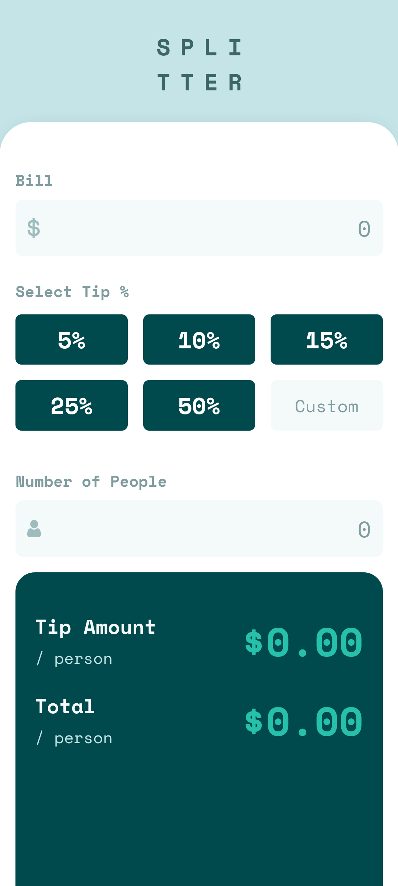

# Frontend Mentor - Tip calculator app solution

This is a solution to the [Tip calculator app challenge on Frontend Mentor](https://www.frontendmentor.io/challenges/tip-calculator-app-ugJNGbJUX). Frontend Mentor challenges help you improve your coding skills by building realistic projects.

## Table of contents

- [Overview](#overview)
  - [The challenge](#the-challenge)
  - [Screenshot](#screenshot)
  - [Links](#links)
- [My process](#my-process)

  - [Built with](#built-with)
  - [What I learned](#what-i-learned)

- [Author](#author)

## Overview

### The challenge

Users should be able to:

- View the optimal layout for the app depending on their device's screen size
- See hover states for all interactive elements on the page
- Calculate the correct tip and total cost of the bill per person

### Screenshot

    Desktop View


    Mobile View



### Links

- Solution URL: [Click Here](https://github.com/sreehariv-code/tip-calculator-app-main)
- Live Site URL: [Click Here](https://sreehariv-code.github.io/tip-calculator-app-main/)

## My process

### Built with

- [React](https://react.dev/) - JS library
- [TailwindCSS](https://tailwindcss.com/) - CSS Framework
- Desktop First Approach

### What I learned

Created a regex function to accept floating number

```javascript
function isValidNumber(value) {
  // Regular expression to match numbers with optional decimal places
  const regex = /^\d*\.?\d*$/;
  return regex.test(value);
}
```

## Author

- Frontend Mentor - [@sreehariv-code](https://www.frontendmentor.io/profile/sreehariv-code)
- Twitter - [@sreehariv07](https://x.com/https://x.com/sreehariv07)
